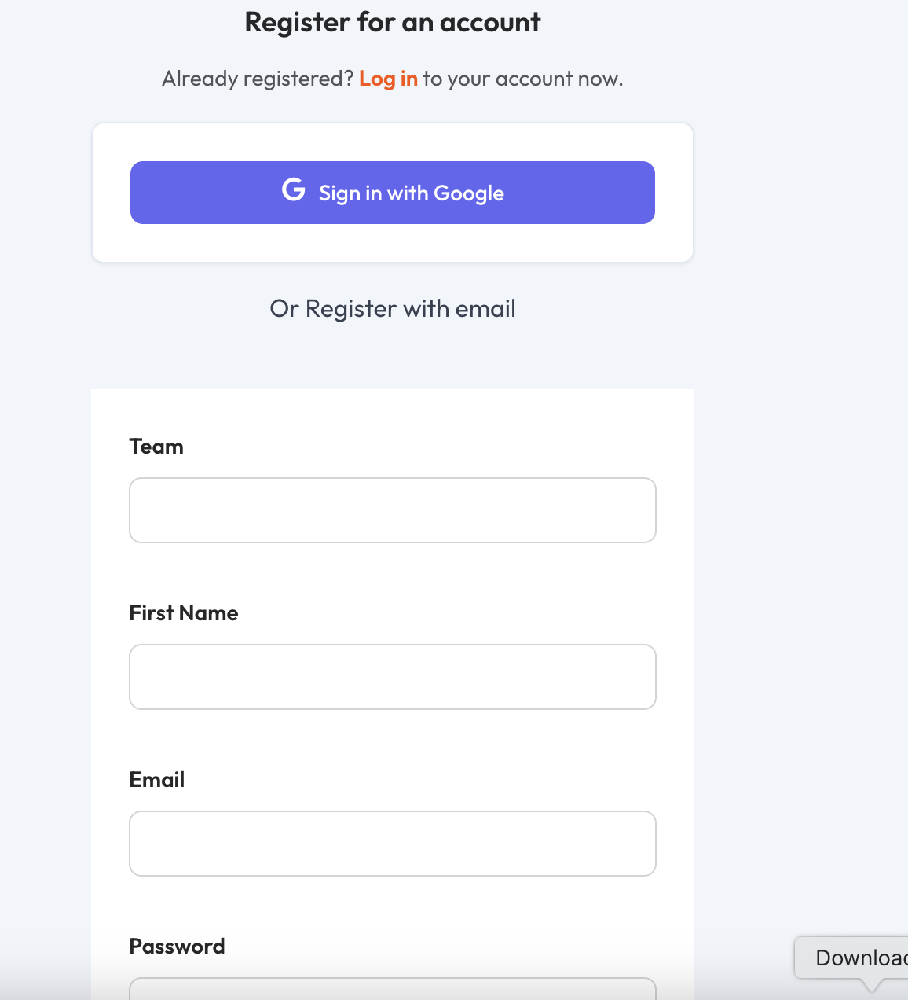

## Oauth Social login
Phoenixjumpstart comes with support for Google OAuth social login out of the box. This allows your users to login/register to your application using their Google account

Support for Facebook, Google, Twitter (X) login in planned.

### Google login

### How to configure google oauth
add istructions on how to add google auth